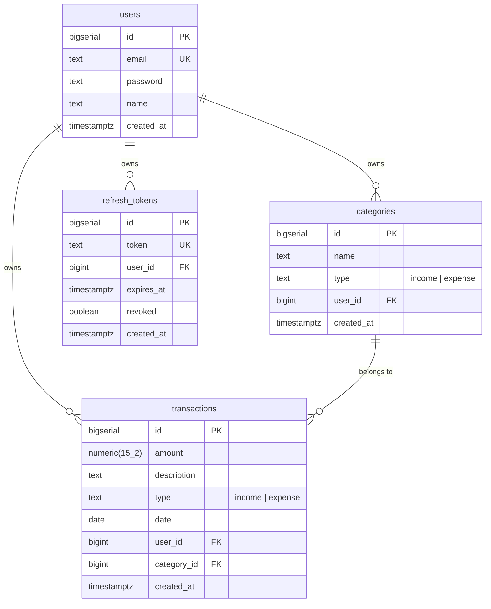
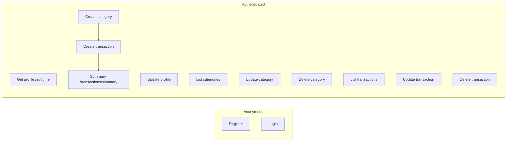

# Finance Tracker API

REST API for personal finance tracking. Built test-first — **128 e2e tests are RED by design**. Your job: make them green.

## Stack

- **Runtime:** Node.js 20+, TypeScript (strict)
- **Framework:** NestJS 11
- **DB:** PostgreSQL + Prisma
- **Auth:** JWT (access) + opaque refresh token (DB, httpOnly cookie)
- **Validation:** Zod
- **Test:** Vitest + supertest
- **Format:** Biome

## Prerequisites

- Node.js 20+
- PostgreSQL running locally
- Two databases: `finance_dev` and `finance_test`

### Create databases

```bash
createdb finance_dev
createdb finance_test
```

## Setup

```bash
npm install
cp .env.example .env
cp .env.example .env.test
# Edit both: set DATABASE_URL to point to the right DB
# .env       → finance_dev
# .env.test  → finance_test
```

## Scripts

| Command | What it does |
|---------|--------------|
| `npm test` | Run all e2e tests |
| `npm run test:watch` | Vitest watch mode |
| `npm run build` | Build with NestJS CLI |
| `npm run start:dev` | Dev server with SWC |
| `npm run db:migrate` | Prisma migrate dev |
| `npm run db:generate` | Prisma generate client |
| `npm run typecheck` | tsc --noEmit |
| `npm run lint` | Biome check |

## Project structure

```
.
├── docs/api/                   # OpenAPI spec
│   ├── openapi.yaml
│   ├── common/
│   │   ├── schemas.yaml
│   │   └── responses.yaml
│   ├── auth/paths.yaml
│   ├── users/paths.yaml
│   ├── categories/paths.yaml
│   ├── transactions/paths.yaml
│   └── summary/paths.yaml
├── prisma/
│   └── schema.prisma           # ← DB schema (fill this in)
├── src/                        # NestJS app (implement here)
│   └── ...
└── tests/
    └── e2e/
        ├── helpers.ts          # API-based seeders
        ├── auth.test.ts        # 28 tests
        ├── users.test.ts       # 12 tests
        ├── categories.test.ts  # 16 tests
        ├── transactions.test.ts# 32 tests
        ├── summary.test.ts     # 10 tests
        └── integration.test.ts # 5 flows
```

## Entity-relationship diagram



## Use cases



## TDD workflow

1. Run `npm test` — all 128 tests fail (routes don't exist yet).
2. Pick the simplest test, e.g. `auth.test.ts` → "POST /auth/register returns 201".
3. Write the Prisma schema in `prisma/schema.prisma`.
4. Run `npm run db:migrate` to apply.
5. Run `npm run db:generate` to generate typed Prisma client + TypedSQL.
6. Implement using **typed Prisma queries**:
   - DTO (Zod schema)
   - Service (Prisma typed queries or TypedSQL)
   - Controller (HTTP layer)
   - Module (wire everything)
7. Mount in `app.module.ts`.
8. Run `npm test` — that test green, others still red.
9. Repeat.

### Prisma typed queries

Two ways to query with type safety:

#### 1. Typed Client (CRUD operations)

```typescript
// ✅ Typed — autocomplete, compile-time errors
const user = await prisma.user.findUnique({ where: { email } })
const txns = await prisma.transaction.findMany({
  where: { userId, type: 'expense' },
  include: { category: true },
})
```

#### 2. TypedSQL (complex queries)

Write SQL in `prisma/sql/*.sql` files with type-safe parameters:

```sql
-- prisma/sql/getTransactionsByDateRange.sql
-- @param {Int} $1:userId
-- @param {DateTime} $2:from
-- @param {DateTime} $3:to
SELECT t.*, c.name as "categoryName"
FROM transactions t
JOIN categories c ON t.category_id = c.id
WHERE t.user_id = $1
  AND t.date >= $2
  AND t.date <= $3
ORDER BY t.date DESC
```

Use in TypeScript:

```typescript
import { getTransactionsByDateRange } from './generated/prisma/sql'

const txns = await prisma.$queryRawTyped(
  getTransactionsByDateRange(userId, fromDate, toDate)
)
```

Generated client output: `src/generated/prisma/` (auto-generated, do not edit).

## API spec

All requests/responses are JSON. Auth uses `Authorization: Bearer <token>` (JWT) or `refresh_token` cookie.

### Response envelope

**Success:**
```json
{ "message": "Login successful.", "requestId": "req_abc123", "data": { ... } }
```

**Success with pagination:**
```json
{ "message": "Transactions retrieved.", "requestId": "req_abc123", "data": [...], "meta": { "page": 1, "limit": 20, "total": 45, "totalPages": 3 } }
```

**Error:**
```json
{ "message": "Invalid email or password.", "requestId": "req_abc123", "code": "auth.credentials.invalid" }
```

**Validation error:**
```json
{ "message": "Validasi gagal.", "requestId": "req_abc123", "code": "validation.failed", "error": [{ "field": "email", "code": "required", "message": "Wajib diisi." }] }
```

### Error codes

| Code | HTTP | When |
|------|------|------|
| `validation.failed` | 400 | Input validation fails |
| `unauthorized` | 401 | No token / invalid token |
| `auth.credentials.invalid` | 401 | Wrong email/password |
| `auth.refresh.invalid` | 401 | Refresh token revoked/expired |
| `auth.password.wrong_current` | 401 | Wrong current password |
| `forbidden` | 403 | Not owner |
| `not_found` | 404 | Resource not found |
| `auth.user.exists` | 409 | Email already registered |
| `category.in_use` | 409 | Category has transactions |
| `internal_error` | 500 | Fallback |

### Endpoints

| Method | Path | Auth | Body | Success |
|--------|------|------|------|---------|
| POST | `/auth/register` | – | `{ email, password, name }` | 201 `{ user, accessToken }` + Set-Cookie |
| POST | `/auth/login` | – | `{ email, password }` | 200 `{ user, accessToken }` + Set-Cookie |
| POST | `/auth/rotate` | cookie | – | 200 `{ accessToken }` + Set-Cookie |
| POST | `/auth/logout` | cookie | – | 200 + Clear-Cookie |
| GET | `/auth/me` | Bearer | – | 200 `{ user }` |
| GET | `/users/:id` | – | – | 200 `{ user }` |
| PATCH | `/users/:id` | Bearer (self) | `{ name?, email?, password?, currentPassword? }` | 200 `{ user }` |
| POST | `/categories` | Bearer | `{ name, type }` | 201 `{ category }` |
| GET | `/categories` | Bearer | query: `type?` | 200 `[{ category }]` |
| PATCH | `/categories/:id` | Bearer (owner) | `{ name?, type? }` | 200 `{ category }` |
| DELETE | `/categories/:id` | Bearer (owner) | – | 204 |
| POST | `/transactions` | Bearer | `{ amount, description, type, categoryId, date }` | 201 `{ transaction }` |
| GET | `/transactions` | Bearer | query: `type?, categoryId?, from?, to?, page?, limit?` | 200 `[...transactions]` + meta |
| GET | `/transactions/summary` | Bearer | query: `from?, to?` | 200 `{ totalIncome, totalExpense, balance, byCategory }` |
| GET | `/transactions/:id` | Bearer (owner) | – | 200 `{ transaction }` |
| PATCH | `/transactions/:id` | Bearer (owner) | partial | 200 `{ transaction }` |
| DELETE | `/transactions/:id` | Bearer (owner) | – | 204 |

### Enums

- `type`: `income | expense`

### Filters

| Param | Endpoint | Meaning |
|-------|----------|---------|
| `type` | GET /categories, GET /transactions | exact match |
| `categoryId` | GET /transactions | filter by category |
| `from` | GET /transactions, GET /transactions/summary | date >= from |
| `to` | GET /transactions, GET /transactions/summary | date <= to |
| `page` | GET /transactions | 1-based, default 1 |
| `limit` | GET /transactions | default 20, max 100, min 1 |

### Validation rules

- `email`: valid email format
- `password`: minimum 8 characters
- `amount`: numeric string, > 0, max 2 decimal places
- `type`: enum `income | expense`
- `date`: valid date string (YYYY-MM-DD)
- `categoryId`: must exist and belong to user
- `name` (category): non-empty
- Password change: must include `currentPassword`

### Auth flow

```
Register: POST /auth/register
  → hash password (bcrypt)
  → create user
  → create refresh_token (opaque random, 7d expiry)
  → Set-Cookie: refresh_token=<token>; HttpOnly; SameSite=Lax; Path=/auth/rotate,/auth/logout; Max-Age=604800
  → Response: { message, requestId, data: { user, accessToken } }

Login: POST /auth/login
  → verify credentials
  → create refresh_token
  → Set-Cookie: (same)
  → Response: (same)

Rotate: POST /auth/rotate (reads refresh_token from cookie)
  → validate: exists, not revoked, not expired
  → revoke old token
  → create new refresh_token + new accessToken
  → Set-Cookie: refresh_token=<new_token>
  → Response: { message, requestId, data: { accessToken } }

Logout: POST /auth/logout
  → revoke refresh_token
  → Clear-Cookie: refresh_token
  → Response: { message, requestId }

Me: GET /auth/me (Bearer <accessToken>)
  → JwtAuthGuard validates
  → Response: { message, requestId, data: { user } }
```

## Conventions

- **Response wrapper:** `{ message, requestId, data?, meta?, code?, error? }`
- **Invariant:** success → `data` present, `code` absent; error → `code` present, `data` absent
- **snake_case → camelCase:** DB columns snake_case, API responses camelCase
- **Passwords:** bcrypt hashed, never returned in responses
- **Amounts:** `numeric(15,2)` in DB, string in API (exact precision)
- **Tests:** API-based only — `helpers.ts` must not query DB directly
